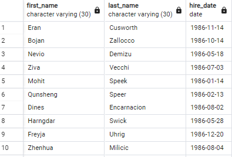
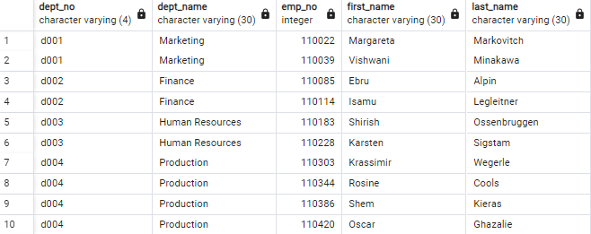

## SQL-Challenge

## Introduction

Data engineering and Database project that involves designing database tables to accommodate the data, importing the CSV files into a SQL database, and conducting data analysis to extract insights. The data is employees hired during the 1980s and 1990s and consists of six CSV files.  The aim is to create an effective database schema, import data accurately, and derive valuable information from the database. 

## Entity Relationship Diagram

## PostgreSQL
Using the Entity Relationship Diagram, tables were created for each csv file
(Official_ERD_Schema.sql) 

    -- Data Modeling of Entity Relationship Diagram of the tables
    DROP TABLE IF EXISTS titles CASCADE;
    DROP TABLE IF EXISTS salaries CASCADE;
    DROP TABLE IF EXISTS employees CASCADE;
    DROP TABLE IF EXISTS dept_manager CASCADE;
    DROP TABLE IF EXISTS dept_emp CASCADE;
    DROP TABLE IF EXISTS departments CASCADE;

    -- Create all tables--
    ---------------------------------------------
    CREATE TABLE employees (
        emp_no int   NOT NULL,
        emp_title_id Varchar(5)   NOT NULL,
        birth_date DATE   NOT NULL,
        first_name Varchar(30)   NOT NULL,
        last_name Varchar(30)   NOT NULL,
        sex Varchar(1)   NOT NULL,
        hire_date DATE   NOT NULL,
        CONSTRAINT pk_employees PRIMARY KEY (
            emp_no
        )
    );
    Select * From employees;
    -------------------------------------------
    CREATE TABLE departments (
        dept_no Varchar(4)   NOT NULL,
        dept_name Varchar(30)   NOT NULL,
        CONSTRAINT pk_departments PRIMARY KEY (
            dept_no
        )
    );
    Select * From departments;
    -------------------------------------------
    CREATE TABLE dept_emp (
        emp_no int   NOT NULL,
        dept_no Varchar(4)   NOT NULL);
    Select * From dept_emp;
    ---------------------------------------------
    CREATE TABLE dept_manager (
        dept_no Varchar(4)   NOT NULL,
        emp_no int   NOT NULL);
    Select * From dept_manager;
    -----------------------------------------
    CREATE TABLE salaries (
        emp_no int   NOT NULL,
        salary int   NOT NULL);
    Select * From salaries;
    ---------------------------------------------
    CREATE TABLE titles (
        title_id Varchar(5)   NOT NULL,
        title Varchar(30)   NOT NULL,
        CONSTRAINT pk_title PRIMARY KEY (
            title_id
        )
    );
    Select * From titles;
    -------------------------------------------
    ALTER TABLE "dept_emp" ADD CONSTRAINT "fk_dept_emp_emp_no" FOREIGN KEY("emp_no")
    REFERENCES "employees" ("emp_no");

    ALTER TABLE "dept_emp" ADD CONSTRAINT "fk_dept_emp_dept_no" FOREIGN KEY("dept_no")
    REFERENCES "departments" ("dept_no");

    ALTER TABLE "dept_manager" ADD CONSTRAINT "fk_dept_manager_dept_no" FOREIGN KEY("dept_no")
    REFERENCES "departments" ("dept_no");

    ALTER TABLE "dept_manager" ADD CONSTRAINT "fk_dept_manager_emp_no" FOREIGN KEY("emp_no")
    REFERENCES "employees" ("emp_no");

    ALTER TABLE "employees" ADD CONSTRAINT "fk_employees_emp_title_id" FOREIGN KEY("emp_title_id")
    REFERENCES "titles" ("title_id");

    ALTER TABLE "salaries" ADD CONSTRAINT "fk_salaries_emp_no" FOREIGN KEY("emp_no")
    REFERENCES "employees" ("emp_no");

## Queries
**List the employee number, last name, first name, sex, and salary of each employee. Output shows top 10 rows.**

**List the first name, last name, and hire date for the employees who were hired in 1986. Output shows top 10 rows.**

**List the manager of each department along with their department number, department name, employee number, last name, and first name. Output shows top 10 rows.**

**List the department number for each employee along with that employee’s employee number, last name, first name, and department name. Output shows top 10 rows.**

**List first name, last name, and sex of each employee whose first name is Hercules and whose last name begins with the letter B. Output shows top 10 rows.**

**List each employee in the Sales department, including their employee number, last name, and first name. Output shows top 10 rows.**

**List each employee in the Sales and Development departments, including their employee number, last name, first name, and department name. Output shows top 10 rows.**

**List the frequency counts, in descending order, of all the employee last names (that is, how many employees share each last name). Output shows top 10 rows.
**

## Resources

* Count Frequency - https://joshfrankel.me/blog/calculating-frequency-distribution-in-postgresql/

